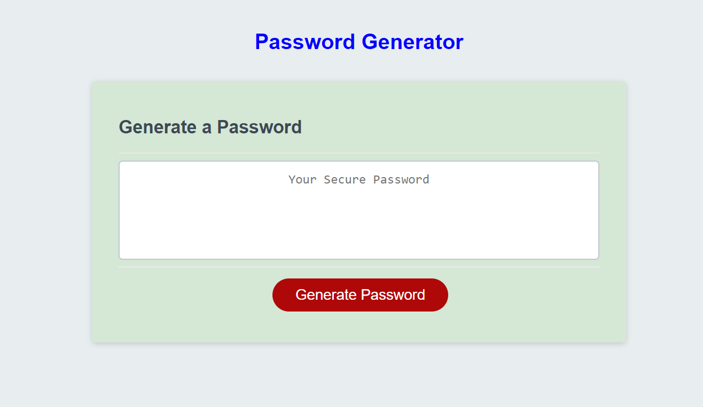

# Password-Generator

[link to site](https://tooqk4u.github.io/Password-Generator/)

Module 3 JavaScript

Project is created with the following programming languages:

HTML
CSS
Javascript

This project is a password generator that prompts the user to select the length of their password, then select 1-4 types of characters to include. The program then generates a randomized password in the specifed length with the user choices of one to four character types included in the password.

This challenge required using JavaScript to code a password generator. It was my first eperience with JavaScript and I have to say I was very intimidated. I learned about "prompts", "alerts" and "confirms". The program required validation in 2 functions to ensure the user input was correct and if not to prompt the user to enter the requested information. This is where I learned NaN is a function in JavaScript. Finally it required a "for loop". This was a difficult assignment and I ran into multiple issues with syntax and spelling as well as again messing up my repository by switching my files around. On the other hand I am getting very experienced with merge conflicts, git reverts and other tactics to fix repository mistakes. I wuld like to give credit to Phil Loy, my tutor for helping me find the simplest way to create this application. His assistance was invaluable.

